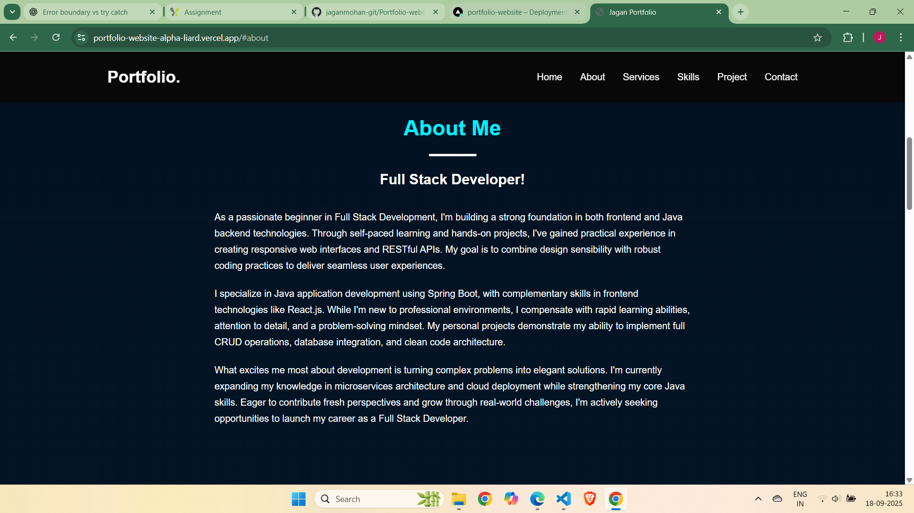

# Jagan Mohan - Portfolio Website

## Project Overview
This is the personal portfolio website of Jagan Mohan, a motivated full stack developer. The website showcases my skills, projects, services, and provides a way to contact me directly. The purpose of this portfolio is to present my work, technical skills, and professional experience to potential employers and collaborators.

## Features
- **About Me Section**: Detailed introduction highlighting my skills, passion, and experience.
- **Projects Section**: Displays my personal and academic projects with visuals.
- **Services Section**: Highlights services I can provide as a developer.
- **Skills Section**: Showcases both technical and professional skills using progress bars.
- **Resume Download Button**: Allows visitors to download my resume directly.
- **Contact Form & Social Links**: Visitors can send messages directly via the form and connect with me on social platforms like WhatsApp, LinkedIn, GitHub, and Email.

## Tech Stack
- HTML
- CSS
- JavaScript
- Font Awesome (for icons)
- Vercel (for deployment)

## Deployment Link
Check out the live version of my portfolio here: [Jagan Mohan Portfolio](https://portfolio-website-alpha-liard.vercel.app/)

## Screenshots
### Home

### About

### Services

### Skills

### Projects & Contact

---

## About Me
I am Jagan Mohan, a passionate full stack developer with hands-on experience in building web applications using HTML, CSS, JavaScript, and modern frameworks. I enjoy solving complex problems and continuously improving my technical skills.  

## Projects
Here are some projects I have worked on:

1. **Student Course Management System** - A web app to manage students and course enrollments with CRUD operations.  
2. **IMDb Movie Reviews Analysis** - A Python project analyzing user reviews and ratings.  
3. **Portfolio Website** - Showcases my skills, projects, and contact information.  

## Skills
- **Frontend**: HTML, CSS, JavaScript, React Basics  
- **Backend**: Java, Spring Boot  
- **Database**: SQL  
- **Other Tools**: Git, GitHub, Vercel  

## Contact
Feel free to reach out via:

- **Email**: [jaganmohan.work@gmail.com](mailto:jaganmohan.work@gmail.com)  
- **LinkedIn**: [https://www.linkedin.com/in/jaganmohan-git](https://www.linkedin.com/in/jaganmohan-git)  
- **GitHub**: [https://github.com/jaganmohan-git](https://github.com/jaganmohan-git)  
- **WhatsApp**: [https://wa.me/918639115990](https://wa.me/918639115990)

---

*This portfolio is a live demonstration of my skills and projects. Feel free to explore and connect!*
